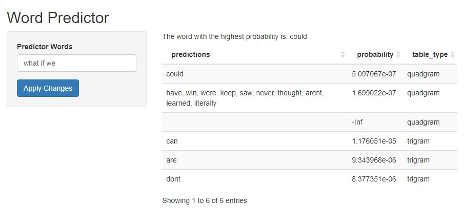

```{r, message = F, warning = F}
library(tidytext)
library(tibble)
library(dplyr)
library(stringr)
library(kableExtra)
library(tidyr)
library(wordcloud)
library(ggplot2)
library(scales)
library(gridExtra)
library(reshape2)
library(igraph)
library(ggraph)
library(data.table)
```

```{r setup, include = F}
knitr::opts_chunk$set(cache = T, message = F, warning = F)
```

## Synopsis 

The raw data for this project comprises of data scraped from the web and stored in three text files (each line represents one sample). The three files were imported as three character vectors: news, blogs, and twitter with each index representing a single sample (i.e. a full article or tweet).

The goal of this project is to produce an application that accepts a string of words and predicts the next word using a corpus sample extracted from the raw data above.

The large corpus of text documents was processed, cleaned, analyzed and visualized using a number of language processing packages in R including `tidytext`, `stringr` and `wordcloud` to name a few. `tidytext` is especially useful as it provides the capability to interact with textual data using 'dplyr' like functions for quick and easy exploration.

A Markov Chain model is produced using quadgrams, trigrams, and bigrams structured into frequency tables. The tables allow for easy determination of the highest probability ngram given a series of words as an input.

In a future project I plan to explore the use of LSTM deep learning to compare the effectiveness of these different methods at predicting the next word in a sentence.

The repository for this project can be found on my [github](https://github.com/krozic/Word-Prediction-Model)

## Getting and Processing the Data

### Importing Raw Data

```{r, message = F, warning = F}
newsRaw <- readLines('../data/final/en_US/en_US.news.txt', encoding = 'UTF-8')
blogsRaw <- readLines('../data/final/en_US/en_US.blogs.txt', encoding = 'UTF-8')
twitterRaw <- readLines('../data/final/en_US/en_US.twitter.txt', encoding = 'UTF-8')
```

### Comparison of Unprocessed Data

```{r}
tibble(Source = c('news', 'blogs', 'twitter'),
       'Number of Samples' = c(length(newsRaw),
                               length(blogsRaw),
                               length(twitterRaw)),
       'Total Characters' = c(sum(nchar(newsRaw)), 
                              sum(nchar(blogsRaw)), 
                              sum(nchar(twitterRaw))),
       'Average Characters' = c(round(mean(nchar(newsRaw))),
                                round(mean(nchar(blogsRaw))),
                                round(mean(nchar(twitterRaw))))
       ) %>%
        kbl() %>%
        kable_styling(bootstrap_options = c("striped", 
                                            "hover", 
                                            "condensed"),
                      full_width = F)

```

### Processing the Raw Data

After taking a look at the least common 'words' in the files, many were found to contain large amounts of white space, special characters, numbers, and non-english words. I kept only 'alpha' characters and spaces for this project. Any web urls also were removed.

```{r}
news <- gsub('(https?|www.)\\S*', '', newsRaw, perl = T)
news <- gsub('[^a-zA-Z[:space:]]', '', news, perl = T)
news <- str_squish(news)
blogs <- gsub('(https?|www.)\\S*', '', blogsRaw, perl = T)
blogs <- gsub('[^a-zA-Z[:space:]]', '', blogs, perl = T)
blogs <- str_squish(blogs)
twitter <- gsub('(https?|www.)\\S*', '', twitterRaw, perl = T)
twitter<- gsub('[^a-zA-Z[:space:]]', '', twitter, perl = T)
twitter <- str_squish(twitter)
```

### Creation of a data table containing samples

```{r}
tidyData <- rbind(tibble(source = 'news', 
                         text = news,
                         sample = 1:length(news)),
                  tibble(source = 'blogs', 
                         text = blogs,
                         sample = 1:length(blogs)),
                  tibble(source = 'twitter', 
                         text = twitter,
                         sample = 1:length(twitter)))
tidyData$source <- factor(tidyData$source, 
                          levels = c('news', 'blogs', 'twitter'))
```

The starting data consists of 3 character vectors containing a sample at each index. Each vector was first converted to a data frame (here, a 'tibble') with the a line number and text column for easier handling and viewing.

### Tokenization

My goal of this section is to create a tidy text format: A table with one-token-per-row. A token is a meaningful unit of text, such as a word or punctuation. Tokenization is the process of turning text into tokens.

`unnest_tokens()` is a part of the `tidytext` package in R and splits a column of character strings into tokens (one-token-per-row).

```{r, cache = F}
tidyWords <- tidyData %>%
        unnest_tokens(word, text)
```

```{r}
tidyWords %>%
        group_by(source) %>%
        count(word, name = 'Times Word Occurs') %>%
        count(`Times Word Occurs`, name = 'Number of Words') %>%
        arrange(`Times Word Occurs`)
```

Blogs and twitter have significantly more words that appear only 1 time, likely due to incorrect spelling or non-words used in these lax sources.

The data frame `stop_words` is also provided by the `tidytext` package which provides 1149 stop words from three lexicons ('SMART', 'onix', or 'snowball'). Stop words are the most common words that provide little to no insight into our data, which is why they're removed before analysis. The FCC '7 banned words' were used to remove profanity.

```{r, cache = F}
profanity <- tibble(word = readLines('../data/curses'))
tidyWords <- tidyWords %>% anti_join(profanity)
cleanWords <- tidyWords %>% anti_join(stop_words)
```

## Visualizing Word Frequency

Data that is useful in this exploration phase is frequency count of words and the proportion of words to compare sources to each other.

```{r}
commonWords <- cleanWords %>%
        group_by(source) %>%
        count(word, sort = T, name = 'freq') %>%
        mutate(prop = freq / sum(freq)) %>%
        ungroup()
```

### Frequency Table

First I made a table with the top 10 most common words, showing their frequency.

```{r}
commonWordsTable <- cbind(commonWords %>%
                                  filter(source == 'news') %>%
                                  select(word, freq) %>%
                                  slice_head(n = 10),
                           commonWords %>%
                                   filter(source == 'blogs') %>%
                                   select(word, freq) %>%
                                   slice_head(n = 10), 
                           commonWords %>%
                                   filter(source == 'twitter') %>%
                                   select(word, freq) %>%
                                   slice_head(n = 10))
```

```{r}
commonWordsTable %>%
        kbl() %>%
        kable_styling(bootstrap_options = c("striped", 
                                            "hover", 
                                            "condensed"),
                      full_width = F) %>%
        add_header_above(c('News' = 2, 'Blogs' = 2, 'Twitter' = 2))
```

### Frequency Plots

Using `ggplot2` the most frequent words can be visualized very easily:

```{r}
commonWords %>% 
        group_by(source) %>% 
        arrange(-prop) %>% 
        slice_head(n = 10) %>%
        ungroup() %>%
        (function(df) merge(df, count(df, word, name = 'overlap'))) %>%
# propGraph <- merge(propGraph, count(propGraph, word, name = 'overlap'))
# propGraph %>%
        ggplot(aes(x = prop, y = word, fill = factor(overlap))) +
        geom_col() +
        facet_grid(~source) +
        # theme(legend.title = element_text('# of Overlaps'))
        labs(y = NULL, x = '%') +
        scale_fill_discrete(name = 'Overlaps Between Sources:') +
        theme(legend.position = 'top', legend.justification = 0)
```

The words 'time', 'people', and 'dont' are found in all 3 top 10 words, while 'love', 'im', and 'day' are common only between blogs and twitter.

### Coverage

Sorting words by frequency gives a metric to visualize how much of the data is coverved with a specific number of top words.

```{r}
coverageData <- tidyWords %>% 
        count(word, sort = T, name = 'freq') %>% 
        mutate(prop = freq / sum(freq)) %>%
        mutate(coverage = cumsum(prop)) %>%
        mutate(numwords = row_number())
```

```{r}
coverageData %>% 
        ggplot(aes(numwords, coverage)) +
        geom_line(size = 1) +
        scale_x_log10() +
        scale_y_continuous(labels = percent_format())
```

How many unique words do you need in a frequency sorted dictionary to cover 50% of all word instances in the language? 90%? 

```{r}
rbind(
        coverageData %>% 
                filter(coverage >= 0.5) %>% 
                slice_head(n = 1) %>%
                select(coverage, numwords),
        coverageData %>% 
                filter(coverage >= 0.9) %>% 
                slice_head(n = 1) %>%
                select(coverage, numwords)
)
```

### Word Plots

```{r, warning = F}
plotWords <- commonWords %>% 
        select(-freq) %>% 
        filter(prop >= 0.00001) %>% 
        spread(source, prop)
nbplot <- plotWords %>%
        ggplot(aes(x = blogs, y = news, color = abs(news - blogs))) +
        geom_abline(color = 'gray40', lty = 2) +
        geom_jitter(alpha = 0.1, size = 2, width = 0.2, height = 0.2) +
        geom_text(aes(label = word), check_overlap = T, vjust = 1.5) +
        scale_x_log10(labels = percent_format()) + 
        scale_y_log10(labels = percent_format()) +
        scale_color_gradient(limits = c(0, 0.0001),
                             low = 'darkslategray4', high = 'gray75') +
        theme(legend.position = 'none')
ntplot <- plotWords %>%
        ggplot(aes(x = twitter, y = news, color = abs(news - twitter))) +
        geom_abline(color = 'gray40', lty = 2) +
        geom_jitter(alpha = 0.1, size = 2, width = 0.2, height = 0.2) +
        geom_text(aes(label = word), check_overlap = T, vjust = 1.5) +
        scale_x_log10(labels = percent_format()) + 
        scale_y_log10(labels = percent_format()) +
        scale_color_gradient(limits = c(0, 0.0001),
                             low = 'darkslategray4', high = 'gray75') +
        theme(legend.position = 'none')
tbplot <- plotWords %>%
        ggplot(aes(x = blogs, y = twitter, color = abs(twitter - blogs))) +
        geom_abline(color = 'gray40', lty = 2) +
        geom_jitter(alpha = 0.1, size = 2, width = 0.2, height = 0.2) +
        geom_text(aes(label = word), check_overlap = T, vjust = 1.5) +
        scale_x_log10(labels = percent_format()) + 
        scale_y_log10(labels = percent_format()) +
        scale_color_gradient(limits = c(0, 0.0001),
                             low = 'darkslategray4', high = 'gray75') +
        theme(legend.position = 'none')
grid.arrange(nbplot, ntplot, tbplot, nrow = 1)
```


### Wordclouds 

The package `tidytext` is very handy for manipulating textual data with `dplyr` and other common R operations. However, some functions require a 'term frequency matrix' as their input rather than a data frame. The `reshape2` package allows easy transformation to a matrix and vice versa.

In addition to transforming a data frame into a matrix, the `acast` function can also 'spread' the data to a 'wide' format at the same time (similar to the `spread` function in `tidyr`).

```{r}
cleanWords %>%
        filter('news' == 'news') %>%
        inner_join(get_sentiments('bing')) %>%
        count(word, sentiment, sort = T) %>%
        acast(word ~ sentiment, value.var = 'n', fill = 0) %>%
        comparison.cloud(colors = c('firebrick3', 'dodgerblue3'))
cleanWords %>%
        filter('blogs' == 'blogs') %>%
        inner_join(get_sentiments('bing')) %>%
        count(word, sentiment, sort = T) %>%
        acast(word ~ sentiment, value.var = 'n', fill = 0) %>%
        comparison.cloud(colors = c('firebrick3', 'dodgerblue3'))
cleanWords %>%
        filter('twitter' == 'twitter') %>%
        inner_join(get_sentiments('bing')) %>%
        count(word, sentiment, sort = T) %>%
        acast(word ~ sentiment, value.var = 'n', fill = 0) %>%
        comparison.cloud(colors = c('firebrick3', 'dodgerblue3'))
```


## Planning the Prediction Model

Up to this point the exploration has mainly been exploring single words, with some sentiment analysis. In the final model, bigrams, trigrams and quadgrams will be used to predict the next word in a string of words.

markov chain with transition matrix (stochastic matrix).


### ngram Exploration

In order to reduce the size of the sample data used in visualizations and functions, 10% of the original corpus was sampled into a new variable `modelText`. This variable will be what is used for the rest of the project.

```{r}
set.seed(13579)
modelText <- tibble(text = tidyData$text, sample = 1:length(tidyData$text)) %>%
        sample_frac(0.1)
bigram <- modelText %>%
        unnest_tokens(ngram, text, token = 'ngrams', n = 2)
trigram <- modelText %>%
        unnest_tokens(ngram, text, token = 'ngrams', n = 3) %>%
        filter(!is.na(ngram))
quadgram <- modelText %>%
        unnest_tokens(ngram, text, token = 'ngrams', n = 4) %>%
        filter(!is.na(ngram))
```

```{r}
tibble('ngram Length' = c(2, 3, 4),
       'Number of Grams Occuring More Than Once' =
               c(dim(bigram %>% count(ngram) %>% filter(n > 1))[1],
                 dim(trigram %>% count(ngram) %>% filter(n > 1))[1],
                 dim(quadgram %>% count(ngram) %>% filter(n > 1))[1])
) %>% kbl() %>%
        kable_styling(bootstrap_options = c("striped",
                                            "hover",
                                            "condensed"),
                      full_width = F)
```

### ngram Frequencies

```{r}
bigram_counts <- bigram %>% count(ngram, sort = T)
trigram_counts <- trigram %>% count(ngram, sort = T)
quadgram_counts <- quadgram %>% count(ngram, sort = T)
```

```{r}
bigram_plot <- bigram_counts %>%
        slice_head(n = 20) %>%
        mutate(ngram = reorder(ngram, n)) %>%
        ggplot(aes(n, ngram)) +
        geom_col() +
        ylab(NULL)
trigram_plot <- trigram_counts %>%
        slice_head(n = 20) %>%
        mutate(ngram = reorder(ngram, n)) %>%
        ggplot(aes(n, ngram)) +
        geom_col() +
        ylab(NULL)
quadgram_plot <- quadgram_counts %>%
        slice_head(n = 20) %>%
        mutate(ngram = reorder(ngram, n)) %>%
        ggplot(aes(n, ngram)) +
        geom_col() +
        ylab(NULL)
grid.arrange(bigram_plot, trigram_plot, quadgram_plot, nrow = 1)
```


```{r}
bigram_counts_sep <- bigram_counts %>%
        separate(ngram, c('word1', 'word2'), sep = ' ')
trigram_counts_sep <- trigram_counts %>%
        separate(ngram, c('word1', 'word2', 'word3'), sep = ' ')
quadgram_counts_sep <- quadgram_counts %>%
        separate(ngram, c('word1', 'word2', 'word3', 'word4'), sep = ' ')
```

### Arrow plot

```{r}
bigram_graph <- bigram_counts_sep %>% 
        filter(!word1 %in% stop_words$word) %>%
        filter(!word2 %in% stop_words$word) %>%
        filter(n > 60) %>% 
        graph_from_data_frame()
```

```{r}
a <- grid::arrow(type = "closed", length = unit(.15, "inches"))
ggraph(bigram_graph, layout = "fr") +
        geom_edge_link(aes(edge_alpha = n), 
                       show.legend = FALSE,
                       arrow = a, 
                       end_cap = circle(.07, 'inches')) +
        geom_edge_link() +
        geom_node_point(color = "lightblue", size = 5) +
        geom_node_text(aes(label = name), vjust = 1, hjust = 1)
```

### Description of Prediction Model

The model for this project makes use of a Markov model chain to decide which word is the most likely to occur after the input words based on the sample corpus provided. Once the tables are made, using the model is as simple as looking a string of words up in a table and determining the highest frequency word that follows.

Here is an example of what a portion of the quadgram frequency table looks like:

```{r}
quadgram_freq_matrix <- modelText %>%
    unnest_tokens(ngram, text, token = 'ngrams', n = 4) %>%
    filter(!is.na(ngram)) %>%
    count(ngram, sort = T) %>%
    mutate(n = n/sum(n), 
           coverage = cumsum(n)) %>%
    separate(ngram, c('word1', 'word2', 'word3', 'word4'), sep = ' ') %>%
    unite(query, c(word1, word2, word3), sep = ' ') %>%
    cast_dfm(query, word4, n)

quadgram_freq_matrix[1:6, 1:5] %>% 
        kbl() %>%
        kable_styling(bootstrap_options = c("striped", 
                                            "hover"),
                      full_width = F)
```

## Prediction Application

### Creating the frequency matrixes:

```{r}
quadgram_freq_matrix <- modelText %>%
    unnest_tokens(ngram, text, token = 'ngrams', n = 4) %>%
    filter(!is.na(ngram)) %>%
    count(ngram, sort = T) %>%
    mutate(n = n/sum(n), 
           coverage = cumsum(n)) %>%
    separate(ngram, c('word1', 'word2', 'word3', 'word4'), sep = ' ') %>%
    unite(query, c(word1, word2, word3), sep = ' ') %>%
    cast_dfm(query, word4, n)
trigram_freq_matrix <- modelText %>%
    unnest_tokens(ngram, text, token = 'ngrams', n = 3) %>%
    filter(!is.na(ngram)) %>%
    count(ngram, sort = T) %>%
    mutate(n = n/sum(n), 
           coverage = cumsum(n)) %>%
    separate(ngram, c('word1', 'word2', 'word3'), sep = ' ') %>%
    unite(query, c(word1, word2), sep = ' ') %>%
    cast_dfm(query, word3, n)
bigram_freq_matrix <- modelText %>%
    unnest_tokens(ngram, text, token = 'ngrams', n = 2) %>%
    filter(!is.na(ngram)) %>%
    count(ngram, sort = T) %>%
    mutate(n = n/sum(n), 
           coverage = cumsum(n)) %>%
    separate(ngram, c('word1', 'word2'), sep = ' ') %>%
    cast_dfm(word1, word2, n)
```

Tidy text (tidyr) can be easily transformed into a Document-Term Matrix (DTM) with the function `cast_dfm()` from the library `tidytext`. A DTM is useful here because it is a "sparse matrix" which only requires memory for indexes that contain data. Since this frequency data has a large amount of 'NA' data, it greatly reduces the size of the tables which makes for more feasible sample data to be used in the algorithm.

### Saving DTM to File

These files will be used in the interactive shiny application.

```{r, eval = F}
save(bigram_freq_matrix, file = './data/frequency_tables/bigram_freq_matrix.RData')
save(trigram_freq_matrix, file = './data/frequency_tables/trigram_freq_matrix.RData')
save(quadgram_freq_matrix, file = './data/frequency_tables/quadgram_freq_matrix.RData')
```

### Single Word Prediction

There are three levels of ngram that are utilized for this algorithm: bigram, trigram, and quadgram. After parsing these matrixes some word combinations were found which had the same probability of occurrence. In order to break ties and find the single most likely word an algorithm can be made that utilizes all three ngram tables when determining the most likely word.

The highest probability within the highest ngram matrix is simply multiplied by the probability of the same word pattern in a lower ngram matrix. The following is the code for this algorithm:

```{r}
bigram_adjustment <- function(input_word3, prediction, prob){
        search_query <- input_word3
        col_indexes <- colnames(bigram_freq_matrix) %in% prediction
        prediction <- colnames(bigram_freq_matrix[,col_indexes])
        freq_vector <- as.vector(bigram_freq_matrix[search_query, col_indexes] * prob)
        prob <- max(freq_vector)
        prediction <- prediction[which(freq_vector == prob)]
        return(list(pred = prediction, prob = prob))
}
trigram_adjustment <- function(input_word2, input_word3, prediction, prob){
        search_query <- paste(input_word2, input_word3)
        col_indexes <- colnames(trigram_freq_matrix) %in% prediction
        prediction <- colnames(trigram_freq_matrix[,col_indexes])
        freq_vector <- as.vector(trigram_freq_matrix[search_query, col_indexes] * prob)
        prob <- max(freq_vector)
        prediction <- prediction[which(freq_vector == prob)]
        return(list(pred = prediction, prob = prob))
}
quad_predict <- function(input_word1, input_word2, input_word3){
        search_query <- paste(input_word1, input_word2, input_word3)
        freq_vector <- as.vector(quadgram_freq_matrix[search_query,])
        word_vector <- colnames(quadgram_freq_matrix)
        prob <- max(freq_vector)
        prediction <- list(pred = word_vector[which(freq_vector == prob)],
                           prob = prob)
        if(length(prediction[[1]]) > 1){
                prediction <- trigram_adjustment(input_word2,
                                                 input_word3,
                                                 prediction$pred,
                                                 prediction$prob)
                if(length(prediction[[1]]) > 1){
                        prediction <- bigram_adjustment(input_word3,
                                                        prediction$pred,
                                                        prediction$prob)
                        return(prediction)
                }else{
                        return(prediction)
                }
        }else{
                return(prediction)
        }
}

tri_predict <- function(input_word2, input_word3){
        search_query <- paste(input_word2, input_word3)
        freq_vector <- as.vector(trigram_freq_matrix[search_query,])
        word_vector <- colnames(trigram_freq_matrix)
        prob <- max(freq_vector)
        prediction <- list(pred = word_vector[which(freq_vector == prob)],
                           prob = prob)
        if(length(prediction[[1]]) > 1){
                prediction <- bigram_adjustment(prediction$pred,
                                                prediction$prob)
                return(prediction)
        }else{
                return(prediction)
        }
}
bi_predict <- function(input_word3){
        search_query <- input_word3
        freq_vector <- as.vector(bigram_freq_matrix[search_query,])
        word_vector <- colnames(bigram_freq_matrix)
        prob <- max(freq_vector)
        prediction <- list(pred = word_vector[which(freq_vector == prob)],
                           prob = prob)
        return(prediction)
}

predict_word <- function(input_text){
        input_text <- gsub('[^a-zA-Z[:space:]]', '', input_text)
        input_text <- str_squish(input_text)
        input_words <- as.data.frame(input_text) %>% unnest_tokens(word, input_text)
        input_word1 <- input_words[nrow(input_words)-2,]
        input_word2 <- input_words[nrow(input_words)-1,]
        input_word3 <- input_words[nrow(input_words),]
        
        if(nrow(input_words) >= 3){
                tryCatch(
                        quad_predict(input_word1, input_word2, input_word3),
                        error = function(e){
                                tryCatch(
                                        tri_predict(input_word2, input_word3),
                                        error = function(e){
                                                tryCatch(
                                                        bi_predict(input_word3),
                                                        error = function(e){
                                                                return('No predictions for query.')
                                                        }
                                                )
                                        }
                                )
                        }
                        )
        }else if(nrow(input_words) == 2){
                tryCatch(
                        tri_predict(input_word2, input_word3),
                        error = function(e){
                                tryCatch(
                                        bi_predict(input_word3),
                                        error = function(e){
                                                return('No predictions for query.')
                                        }
                                )
                        }
                        )
        }else if(nrow(input_words) == 1){
                tryCatch(
                        bi_predict(input_word3),
                        error = function(e){
                                return('No predictions for query.')
                        }
                )
        }
}
```

```{r}
predict_word('what if we')
```

### Multiple Predictions

After using the app, it was found that the context is sometimes lost even with quadgram data. In order to provide some more data to the user to increase the chance of a useful result, a new algorithm was produced.

A minimum of 3 results are returned. If the highest ngram runs out of results, blank results with a probability value of "Inf" for infinity are returned, and the next ngram level is parsed for 3 more results. If multiple words have the same probability of occurring they are separated by a ',' and occupy the same cell. A table is compiled and displayed to give a number of options to the user.

```{r}
quad_predict_multi <- function(input_word1, input_word2, input_word3){
        search_query <- paste(input_word1, input_word2, input_word3)
        freq_vector <- as.vector(quadgram_freq_matrix[search_query,])
        word_vector <- colnames(quadgram_freq_matrix)
        prob1 <- max(freq_vector[freq_vector != 0])
        prob2 <- max(freq_vector[freq_vector != 0 & freq_vector != prob1])
        prob3 <- max(freq_vector[freq_vector != 0 & freq_vector != prob1 & freq_vector != prob2])
        prediction <- data.frame(predictions = c(paste(word_vector[which(freq_vector == prob1)], collapse = ', '),
                                                 paste(word_vector[which(freq_vector == prob2)], collapse = ', '),
                                                 paste(word_vector[which(freq_vector == prob3)], collapse = ', ')),
                                 probability = c(prob1, prob2, prob3),
                                 table_type = 'quadgram')
        if (sum(prediction$prob == -Inf)){
                prediction2 <- tri_predict_multi(input_word2, input_word3)
                prediction <- rbind(prediction, prediction2)
                if (sum(prediction2$prob == -Inf)){
                        prediction3 <- bi_predict_multi(input_word3)
                        prediction <- rbind(prediction, prediction3)
                }
        }
        return(prediction)
}

tri_predict_multi <- function(input_word2, input_word3){
        search_query <- paste(input_word2, input_word3)
        freq_vector <- as.vector(trigram_freq_matrix[search_query,])
        word_vector <- colnames(trigram_freq_matrix)
        prob1 <- max(freq_vector[freq_vector != 0])
        prob2 <- max(freq_vector[freq_vector != 0 & freq_vector != prob1])
        prob3 <- max(freq_vector[freq_vector != 0 & freq_vector != prob1 & freq_vector != prob2])
        prediction <- data.frame(predictions = c(paste(word_vector[which(freq_vector == prob1)], collapse = ', '),
                                                 paste(word_vector[which(freq_vector == prob2)], collapse = ', '),
                                                 paste(word_vector[which(freq_vector == prob3)], collapse = ', ')),
                                 probability = c(prob1, prob2, prob3),
                                 table_type = 'trigram')
        if (sum(prediction$prob == -Inf)){
                prediction2 <- bi_predict_multi(input_word3)
                prediction <- rbind(prediction, prediction2)
        }
        return(prediction)
}

bi_predict_multi <- function(input_word3){
        search_query <- input_word3
        freq_vector <- as.vector(bigram_freq_matrix[search_query,])
        word_vector <- colnames(bigram_freq_matrix)
        prob1 <- max(freq_vector[freq_vector != 0])
        prob2 <- max(freq_vector[freq_vector != 0 & freq_vector != prob1])
        prob3 <- max(freq_vector[freq_vector != 0 & freq_vector != prob1 & freq_vector != prob2])
        prediction <- data.frame(predictions = c(paste(word_vector[which(freq_vector == prob1)], collapse = ', '),
                                                 paste(word_vector[which(freq_vector == prob2)], collapse = ', '),
                                                 paste(word_vector[which(freq_vector == prob3)], collapse = ', ')),
                                 probability = c(prob1, prob2, prob3),
                                 table_type = 'bigram')
        return(prediction)
}

predict_words <- function(input_text){
        input_text <- gsub('[^a-zA-Z[:space:]]', '', input_text)
        input_text <- str_squish(input_text)
        input_words <- as.data.frame(input_text) %>% unnest_tokens(word, input_text)
        input_word1 <- input_words[nrow(input_words)-2,]
        input_word2 <- input_words[nrow(input_words)-1,]
        input_word3 <- input_words[nrow(input_words),]
        
        if(nrow(input_words) >= 3){
                tryCatch(
                        quad_predict_multi(input_word1, input_word2, input_word3),
                        error = function(e){
                                tryCatch(
                                        tri_predict_multi(input_word2, input_word3),
                                        error = function(e){
                                                tryCatch(
                                                        bi_predict_multi(input_word3),
                                                        error = function(e){
                                                                return('No predictions for query.')
                                                        }
                                                )
                                        }
                                )
                        }
                        )
        }else if(nrow(input_words) == 2){
                tryCatch(
                        tri_predict_multi(input_word2, input_word3),
                        error = function(e){
                                tryCatch(
                                        bi_predict_multi(input_word3),
                                        error = function(e){
                                                return('No predictions for query.')
                                        }
                                )
                        }
                        )
        }else if(nrow(input_words) == 1){
                tryCatch(
                        bi_predict_multi(input_word3),
                        error = function(e){
                                return('No predictions for query.')
                        }
                )
        }
}
```

```{r}
predict_words('what if we')
```

### The Application

Here is the link to the [Shiny applications](https://krozic.shinyapps.io/Word_Prediction_Application/). It should be noted that due to memory constraints on shinyapps.io, the algorithm had to be pruned of quadgram data. Therefore, this application only parses bigram and trigram matrixes.



